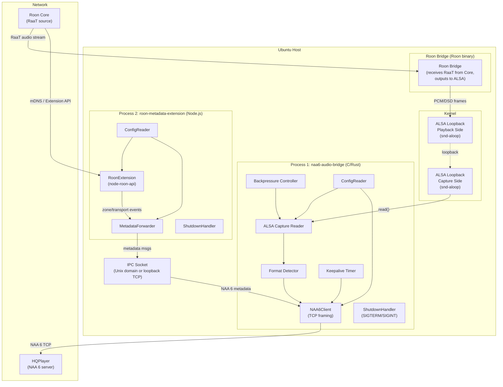

# Design Document: roon-naa6-bridge

## Overview

The roon-naa6-bridge is a **two-process** system that bridges Roon's audio output to HQPlayer's NAA 6 (Network Audio Adapter version 6) protocol. It runs on Ubuntu 24.04 LTS alongside Roon Bridge (Roon's own binary).

The key architectural insight is that the Roon Extension API (`node-roon-api`) is a **control plane only** — it does not expose raw audio frames. Audio is obtained by routing Roon Bridge's output through an ALSA loopback device, which a native C/Rust binary reads and forwards to HQPlayer.

### The Two Processes

**Process 1 — naa6-audio-bridge** (C or Rust binary):
- Opens the ALSA loopback capture device and reads raw PCM/DSD frames
- Implements the NAA 6 protocol over TCP and forwards audio frames to HQPlayer
- Handles: NAA 6 handshake, keepalive, format negotiation, audio forwarding, backpressure, reconnection, graceful shutdown

**Process 2 — roon-metadata-extension** (Node.js):
- Connects to Roon Core as a Roon Extension (control plane only) via `node-roon-api`
- Subscribes to zone/transport state changes to obtain track metadata
- Sends track metadata to HQPlayer via NAA 6 metadata messages (either directly to HQPlayer's NAA 6 port, or via a local IPC socket to naa6-audio-bridge)

### Key Technical Decisions

- **Two-process split**: The Roon Extension API cannot intercept RaaT audio frames. Audio must be captured via ALSA loopback after Roon Bridge writes to it. The metadata extension remains Node.js because `node-roon-api` is Node.js-only.
- **ALSA loopback**: The `snd-aloop` kernel module creates a virtual sound card. Roon Bridge outputs to the playback side; naa6-audio-bridge reads from the capture side. This is the only supported mechanism for intercepting Roon Bridge audio on Linux.
- **C or Rust for audio bridge**: Low-level ALSA access, real-time audio forwarding, and NAA 6 binary framing are better suited to a compiled language. Node.js is not appropriate for this path.
- **NAA 6 over raw TCP**: The NAA 6 protocol is a binary framing protocol. It is implemented directly using POSIX sockets (C) or `tokio::net` (Rust).
- **Shared JSON config**: Both processes read the same `/etc/roon-naa6-bridge/config.json` file.
- **Separate systemd services**: Each process is managed as an independent systemd service unit, allowing independent restart policies.
- **IPC for metadata**: The metadata extension communicates with naa6-audio-bridge (or directly with HQPlayer) via a local Unix domain socket or loopback TCP port.

---

## Architecture



### Component Responsibilities

| Component | Process | Responsibility |
|---|---|---|
| ALSA Loopback (`snd-aloop`) | Kernel | Virtual sound card; playback side receives Roon Bridge output; capture side is read by naa6-audio-bridge |
| Roon Bridge | Roon binary | Receives RaaT from Roon Core; outputs PCM/DSD to ALSA loopback playback device |
| `AlsaCaptureReader` | naa6-audio-bridge | Opens ALSA loopback capture device; reads raw PCM/DSD frames; applies backpressure |
| `FormatDetector` | naa6-audio-bridge | Detects format changes from ALSA hw_params; builds `FormatDescriptor` |
| `NAA6Client` | naa6-audio-bridge | NAA 6 handshake, keepalive, audio framing, metadata relay, session teardown |
| `BackpressureController` | naa6-audio-bridge | Pauses ALSA capture when NAA 6 send buffer is full |
| `ConfigReader` | both | Reads and validates `/etc/roon-naa6-bridge/config.json` |
| `ShutdownHandler` | both | Handles SIGTERM/SIGINT; orchestrates graceful shutdown within 5 s |
| `RoonExtension` | roon-metadata-extension | Registers with Roon Core; subscribes to zone/transport events |
| `MetadataForwarder` | roon-metadata-extension | Extracts `TrackMetadata`; encodes and sends NAA 6 metadata messages |

---

## Components and Interfaces

### ALSA Loopback Setup

The `snd-aloop` kernel module must be loaded and made persistent:

```
# /etc/modules-load.d/snd-aloop.conf
snd-aloop

# /etc/modprobe.d/snd-aloop.conf
options snd-aloop enable=1 index=2
```

Roon Bridge is configured (via its settings) to output to the ALSA loopback playback device (e.g. `hw:Loopback,0,0`). naa6-audio-bridge opens the capture side (`hw:Loopback,1,0`).

### naa6-audio-bridge — AlsaCaptureReader

Opens the ALSA PCM capture device specified in config. Uses `snd_pcm_open`, `snd_pcm_hw_params`, and `snd_pcm_readi` (or the DSD equivalent). On each read:
- Detects hw_params changes (sample rate, format, channels) and notifies `FormatDetector`
- Passes raw frames to `NAA6Client`
- Blocks (or returns EAGAIN) when `BackpressureController` signals pause

### naa6-audio-bridge — FormatDetector

Reads ALSA hw_params after each `snd_pcm_prepare` or params-change event. Constructs a `FormatDescriptor`. On change, notifies `NAA6Client` to send a format-change message before the next audio frame.

### naa6-audio-bridge — NAA6Client

Manages the TCP connection to HQPlayer:

```c
// C interface sketch
int naa6_connect(const char *host, uint16_t port);
int naa6_handshake(const FormatDescriptor *fmt);
int naa6_send_audio(const uint8_t *buf, size_t len);
int naa6_send_format_change(const FormatDescriptor *fmt);
int naa6_send_metadata(const TrackMetadata *meta);
int naa6_send_keepalive(void);
int naa6_send_termination(void);
void naa6_disconnect(void);
```

- Keepalive timer fires at 1 s interval while connected
- On `send()` returning `EAGAIN` or `EWOULDBLOCK`, signals `BackpressureController` to pause ALSA capture; resumes when socket becomes writable again
- On TCP error or close, emits disconnect event; reconnect loop begins after `reconnectBackoff` ms

### naa6-audio-bridge — BackpressureController

Maintains a boolean `paused` flag. When `NAA6Client` signals buffer-full, sets `paused = true` and calls `snd_pcm_pause(1)` (or equivalent). When socket drains, sets `paused = false` and calls `snd_pcm_pause(0)`.

### naa6-audio-bridge — ConfigReader (C/Rust)

Reads `/etc/roon-naa6-bridge/config.json` (fallback: `./config.json`). Parses JSON and populates a `Config` struct. Validates fields on startup; exits non-zero on invalid required values.

### naa6-audio-bridge — ShutdownHandler (C/Rust)

Registers `SIGTERM` and `SIGINT` handlers. On signal:
1. Sets a 5-second hard-kill alarm (`alarm(5)` or equivalent)
2. Calls `naa6_send_termination()` then `naa6_disconnect()`
3. Closes ALSA device
4. Exits with code 0

### roon-metadata-extension — RoonExtension (Node.js)

Wraps `node-roon-api` and `node-roon-api-transport`. Responsibilities:
- Discover Roon Core via mDNS (SDK-managed)
- Pair and register the extension
- Subscribe to zone/transport state changes
- Emit `metadataChanged` events carrying `TrackMetadata`
- On `core_unpaired`, schedule reconnect after `Config.reconnectBackoff` ms
- On graceful shutdown, call `roon.stop()` to deregister

### roon-metadata-extension — MetadataForwarder (Node.js)

Listens for `metadataChanged` events from `RoonExtension`. On each event:
1. Encodes title, artist, album as UTF-8 buffers
2. Validates cover art dimensions ≤ 1024×1024; omits if unavailable
3. Sends the NAA 6 metadata message — either directly to HQPlayer's NAA 6 TCP port, or via the IPC socket to naa6-audio-bridge — within 500 ms of receiving the event
4. If no metadata is available, logs at DEBUG and skips transmission

### roon-metadata-extension — ConfigReader (Node.js)

Same JSON config file as naa6-audio-bridge. Validates fields; exits non-zero on invalid required values.

### roon-metadata-extension — ShutdownHandler (Node.js)

Registers `process.on('SIGTERM')` and `process.on('SIGINT')`. On signal:
1. Sets a 5-second hard-kill timer (`process.exit(1)`)
2. Calls `RoonExtension.deregister()`
3. Clears the hard-kill timer and calls `process.exit(0)`

---

## Data Models

### FormatDescriptor

```typescript
// Shared logical model (C struct / Rust struct / TypeScript interface)
interface FormatDescriptor {
  encoding:    'PCM' | 'DSD_NATIVE' | 'DSD_DOP'
  sampleRate:  number   // Hz for PCM; DSD clock rate for DSD
  bitDepth:    number   // bits per sample (PCM: 16/24/32; DSD: 1)
  channels:    number   // 1–8
  dsdRate?:    'DSD64' | 'DSD128' | 'DSD256' | 'DSD512'  // DSD only
}
```

### TrackMetadata

```typescript
interface TrackMetadata {
  title?:     string   // UTF-8
  artist?:    string   // UTF-8
  album?:     string   // UTF-8
  coverArt?:  Buffer   // raw image bytes, max 1024×1024
}
```

### NAA6Frame (internal wire format)

```typescript
interface NAA6Frame {
  type:    number   // message type byte per NAA 6 spec
  length:  number   // payload length (uint32 LE)
  payload: Buffer
}
```

NAA 6 frame encoding:

```
 0       1       2       3       4       5       6  ...
+-------+-------+-------+-------+-------+-------+--...--+
| type  |         length (uint32 LE)    |    payload     |
+-------+-------+-------+-------+-------+-------+--...--+
```

### Config

```typescript
interface Config {
  outputName:        string   // Roon Output display name (default: "HQPlayer via NAA6")
  alsaDevice:        string   // ALSA loopback capture device (default: "hw:Loopback,1,0")
  hqplayerHost:      string   // HQPlayer hostname or IP (default: "127.0.0.1")
  hqplayerPort:      number   // NAA 6 TCP port (default: 10700)
  reconnectBackoff:  number   // Reconnect interval in ms (default: 5000)
  logLevel:          "info" | "debug"  // (default: "info")
  ipcSocket?:        string   // Unix domain socket path for metadata IPC (default: "/run/roon-naa6-bridge/meta.sock")
}
```

---

## Correctness Properties

*A property is a characteristic or behavior that should hold true across all valid executions of a system — essentially, a formal statement about what the system should do. Properties serve as the bridge between human-readable specifications and machine-verifiable correctness guarantees.*

### Property 1: Valid FormatDescriptor acceptance

*For any* FormatDescriptor with a supported encoding (PCM or DSD), a sample rate from the set {44100, 48000, 88200, 96000, 176400, 192000, 352800, 384000, 705600, 768000} Hz for PCM or a DSD rate from {DSD64, DSD128, DSD256, DSD512}, a bit depth from {16, 24, 32} for PCM, and a channel count in [1, 8], the naa6-audio-bridge shall accept the format and begin forwarding frames to the NAA6Client without error.

**Validates: Requirements 2.2, 2.3, 2.4, 2.5, 2.6**

### Property 2: Roon Output name matches configuration

*For any* non-empty string configured as `outputName`, the display name advertised to Roon Core during extension registration shall equal that configured string.

**Validates: Requirements 1.2**

### Property 3: Reconnect interval is within configured backoff

*For any* `reconnectBackoff` value ≤ 30000 ms, after a simulated Roon Core disconnection, the roon-metadata-extension shall schedule a reconnect attempt within `reconnectBackoff` milliseconds.

**Validates: Requirements 1.4**

### Property 4: Audio bytes are forwarded unmodified

*For any* audio buffer read from the ALSA loopback capture device, the bytes written to the NAA6Client shall be identical to the received bytes — no sample values, byte order, or channel interleaving shall be altered.

**Validates: Requirements 4.1, 4.3**

### Property 5: Handshake precedes audio data

*For any* NAA 6 session, no audio frame bytes shall be written to the TCP socket before the NAA 6 handshake exchange has completed successfully.

**Validates: Requirements 3.2**

### Property 6: Format change message precedes subsequent audio

*For any* mid-session FormatDescriptor change detected from ALSA hw_params, the NAA 6 format-change message shall be written to the TCP socket before any audio frame belonging to the new format.

**Validates: Requirements 2.7, 4.2**

### Property 7: Handshake carries the FormatDescriptor

*For any* FormatDescriptor detected from ALSA hw_params at session start, the NAA 6 handshake payload shall contain the same encoding, sample rate, bit depth, channel count, and (for DSD) DSD rate and encapsulation method.

**Validates: Requirements 5.1, 5.6**

### Property 8: Backpressure propagates from NAA6 socket to ALSA capture

*For any* state where the NAA 6 TCP send buffer is full (send returns EAGAIN/EWOULDBLOCK), the ALSA capture device shall be paused and no further frames shall be read until the socket becomes writable again.

**Validates: Requirements 4.5**

### Property 9: Invalid config values cause non-zero exit

*For any* configuration object containing an invalid value for a required parameter (e.g. `hqplayerPort` outside [1, 65535], non-positive `reconnectBackoff`), the process shall exit with a non-zero exit code and emit an error log identifying the parameter and its invalid value.

**Validates: Requirements 6.5**

### Property 10: Unknown config keys produce a warning and do not halt startup

*For any* configuration object that contains one or more unrecognised keys alongside otherwise valid required parameters, the bridge shall log a warning for each unrecognised key and complete startup successfully.

**Validates: Requirements 6.4**

### Property 11: Error log entries contain description and error code

*For any* error condition (TCP error, ALSA error, handshake failure, malformed frame, etc.), the emitted log entry shall contain a human-readable description string and, where a system error code is available, that error code.

**Validates: Requirements 7.2**

### Property 12: DEBUG log level gates verbose output

*For any* bridge instance configured at INFO level, no DEBUG-level log entries (including FormatDescriptor change details) shall appear in the log output. For any instance configured at DEBUG level, FormatDescriptor change events shall produce a log entry containing the full FormatDescriptor.

**Validates: Requirements 7.3, 7.4**

### Property 13: Metadata extraction round-trip

*For any* Roon zone-change event payload containing title, artist, album, and cover art fields, the `TrackMetadata` object produced by the extraction step shall contain values equal to those in the source payload.

**Validates: Requirements 9.1**

### Property 14: Text metadata is valid UTF-8

*For any* title, artist, or album string, encoding the string to bytes and decoding those bytes as UTF-8 shall yield the original string.

**Validates: Requirements 9.6**

### Property 15: Missing cover art does not suppress other metadata fields

*For any* track where cover art is unavailable, the NAA 6 metadata message shall contain the title, artist, and album fields (when present) and shall omit only the cover art field.

**Validates: Requirements 9.4**

### Property 16: Malformed ALSA frames do not terminate the session

*For any* sequence of audio frames where one or more frames are malformed or produce an ALSA read error, the naa6-audio-bridge shall remain running, log an error for each malformed frame, and continue processing subsequent valid frames.

**Validates: Requirements 2.8**

### Property 17: Shutdown completes within 5 seconds

*For any* bridge process receiving SIGTERM or SIGINT, the full shutdown sequence (NAA 6 termination message, TCP close, ALSA device close / Roon deregistration) shall complete within 5000 milliseconds; if it does not, the process shall exit with a non-zero code.

**Validates: Requirements 8.2, 8.3**

---

## Error Handling

### ALSA Errors

- If the ALSA loopback capture device cannot be opened at startup, naa6-audio-bridge logs a fatal error and exits non-zero. The systemd service will restart it.
- On `snd_pcm_readi` returning `-EPIPE` (overrun), the bridge calls `snd_pcm_prepare` to recover and logs a warning.
- On unrecoverable ALSA errors, the bridge logs the error code and description, then exits; systemd restarts it.

### Roon Core Connection Errors

- On initial startup, if no Roon Core is found, roon-metadata-extension waits indefinitely (the Roon SDK handles mDNS discovery retries).
- On `core_unpaired`, a reconnect is scheduled after `reconnectBackoff` ms. All reconnect attempts are logged at INFO.

### NAA 6 / HQPlayer Connection Errors

- On TCP error or close, naa6-audio-bridge pauses ALSA capture immediately to prevent data loss.
- Reconnect is attempted after `reconnectBackoff` ms. On success, a new handshake is performed and audio resumes.
- If the handshake fails, the error and failure reason are logged and the backoff retry loop continues.
- If HQPlayer rejects the FormatDescriptor, the error is logged.

### Audio Stream Errors

- ALSA overrun (`-EPIPE`): recover via `snd_pcm_prepare`, log warning, continue.
- Unrecognised ALSA format: log error, skip frame, continue.
- NAA 6 send buffer full: pause ALSA capture (backpressure); no frames dropped.

### Configuration Errors

- Missing config file: defaults used, WARNING logged.
- Unknown config key: WARNING logged per key, startup continues.
- Invalid required parameter value: ERROR logged with parameter name and value, process exits with code 1.

### Shutdown Errors

- If the 5-second shutdown deadline is exceeded, a hard exit (`process.exit(1)` / `_exit(1)`) is issued.
- Any errors during the shutdown sequence are logged but do not block the shutdown timer.

---

## Testing Strategy

### Dual Testing Approach

Both unit tests and property-based tests are required. They are complementary:

- **Unit tests** cover specific examples, integration points, and error conditions.
- **Property-based tests** verify universal invariants across many generated inputs.

Unit tests should be kept focused — avoid writing unit tests that duplicate what property tests already cover.

### Process 1: naa6-audio-bridge (C or Rust)

**Language and tooling**:
- If C: use [cmocka](https://cmocka.org/) for unit tests; property-based testing via a C PBT library such as [theft](https://github.com/silentbicycle/theft).
- If Rust: use the built-in `#[test]` framework for unit tests; [`proptest`](https://github.com/proptest-rs/proptest) for property-based tests.

**Unit test coverage**:
- `AlsaCaptureReader`: device open/close, overrun recovery, format change detection
- `NAA6Client`: handshake sent before audio, termination sent on shutdown, error logged on handshake failure
- `BackpressureController`: ALSA paused when send returns EAGAIN, resumed on drain
- `ConfigReader`: missing file uses defaults, invalid value exits non-zero, unknown key warns
- `ShutdownHandler`: force-exit on 5-second timeout

**Property test coverage** (minimum 100 iterations each):

Each property test must include a comment referencing the design property:
```
// Feature: roon-naa6-bridge, Property 4: Audio bytes are forwarded unmodified
```

| Property | Generator inputs | Assertion |
|---|---|---|
| P1: Valid FormatDescriptor acceptance | Random valid FormatDescriptor | No error, frame forwarded |
| P4: Audio bytes unmodified | Random byte buffers | Forwarded bytes === received bytes |
| P5: Handshake before audio | Any session start | No audio bytes before handshake ACK |
| P6: Format change before audio | Random format sequences | Format msg precedes first frame of new format |
| P7: Handshake carries FormatDescriptor | Random FormatDescriptor | Handshake payload fields === FormatDescriptor fields |
| P8: Backpressure to ALSA | Simulated full send buffer | ALSA capture paused; resumes on drain |
| P9: Invalid config exits non-zero | Random invalid configs | Exit with non-zero code |
| P10: Unknown keys warn, continue | Random configs with extra keys | Warning logged, startup completes |
| P11: Error logs contain description+code | Random error types | Log entry has message and code fields |
| P12: Log level gates DEBUG output | Random log level + events | DEBUG absent at INFO; present at DEBUG |
| P16: Malformed frames don't terminate | Random valid + malformed frame sequences | Bridge remains running |
| P17: Shutdown within 5 seconds | Simulated slow shutdown | Exit within 5000 ms or force-exit non-zero |

### Process 2: roon-metadata-extension (Node.js)

**Library**: [`fast-check`](https://github.com/dubzzz/fast-check) for property-based tests; [`vitest`](https://vitest.dev/) for unit tests.

Each property test must run a minimum of **100 iterations** (`numRuns: 100`).

Each property test must include a comment referencing the design property:
```
// Feature: roon-naa6-bridge, Property 13: Metadata extraction round-trip
```

**Unit test coverage**:
- `RoonExtension`: pairing initiated on core discovery, deregistration called on shutdown
- `MetadataForwarder`: no message sent when metadata absent, cover art absent transmits remaining fields
- `ConfigReader`: missing file uses defaults, invalid value exits non-zero, unknown key warns
- `ShutdownHandler`: force-exit on 5-second timeout

**Property test coverage** (minimum 100 iterations each):

| Property | Generator inputs | Assertion |
|---|---|---|
| P2: Output name matches config | Random non-empty strings | Registered name === config name |
| P3: Reconnect within backoff | Random backoff ≤ 30000 ms | Reconnect scheduled ≤ backoff ms |
| P13: Metadata extraction round-trip | Random metadata payloads | Extracted fields === source fields |
| P14: Text metadata is valid UTF-8 | Random Unicode strings | decode(encode(s)) === s |
| P15: Missing cover art omits only cover art | Random metadata without cover art | Message has title/artist/album, no coverArt |

### Integration Testing

- Simulate the full pipeline: mock ALSA capture source → naa6-audio-bridge → mock NAA 6 TCP server
- Assert bytes received at mock server equal bytes read from mock ALSA source
- Assert handshake precedes audio, format-change messages precede new-format audio
- Simulate metadata flow: mock Roon zone event → roon-metadata-extension → IPC → naa6-audio-bridge → mock NAA 6 server
