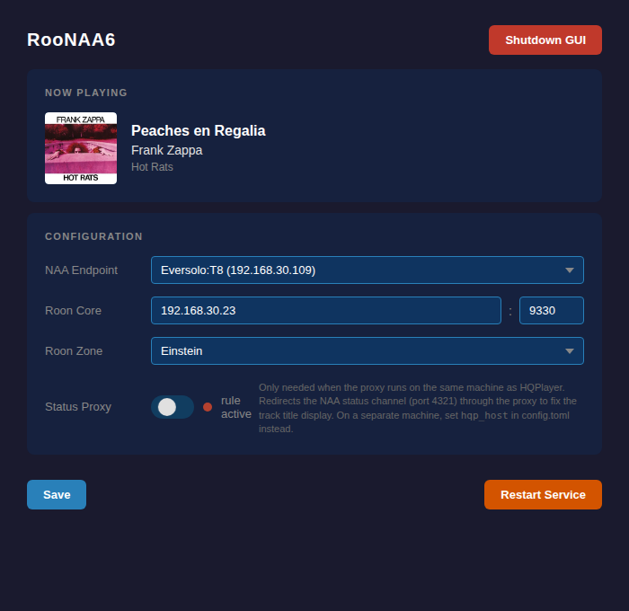

# RooNAA6

Transparent proxy between HQPlayer and an NAA v6 endpoint (e.g. Eversolo T8), injecting Roon track metadata and cover art into the audio stream so the NAA endpoint displays what's playing.

```
Roon Core ──> HQPlayer ──> RooNAA6 proxy ──> NAA endpoint
                              │
                              └── Roon Core WebSocket (metadata)
```



## Disclaimer

This software is **not affiliated with or supported by Signalyst** (the developer of HQPlayer). If you experience issues while using RooNAA6, disable the proxy and connect HQPlayer directly to your NAA endpoint before seeking support from Signalyst. Use at your own risk.

---

## Quick Start

### 1. Install

Download the `.deb` from the [releases page](https://github.com/piercer/RooNAA6/releases):

```bash
sudo dpkg -i roonaa6_*.deb
```

Or build from source (requires Rust toolchain):

```bash
cargo build --release
sudo cp target/release/RooNAA6 /usr/bin/RooNAA6
sudo cp config.toml.example /etc/roonaa6/config.toml
```

### 2. Minimal config

Edit `/etc/roonaa6/config.toml` with just enough to start the proxy and the web GUI:

```toml
[naa]
mcast_iface = "192.168.x.x"    # Your machine's LAN IP

[roon]
host = "192.168.x.x"           # Roon Core IP
zone = "YourZoneName"           # Roon zone to monitor

[web]
enable = true
```

### 3. Start

```bash
sudo systemctl enable --now roonaa6
```

### 4. Pair with Roon

On first launch, authorise the extension in Roon:

**Roon** -> **Settings** -> **Extensions** -> find **RooNAA6 Metadata** -> **Enable**

### 5. Configure via GUI

Open `http://<proxy-ip>:8080` in a browser. The GUI lets you:

- Select your **NAA endpoint** from auto-discovered devices
- Set the **Roon Core** address and **zone**
- Enable the **Status Proxy** (see below)
- **Save** configuration and **Restart** the service

### 6. Select the proxy in HQPlayer

In HQPlayer's device dropdown, select the proxy (it appears under the name of your NAA endpoint). Play music from Roon — metadata and cover art should appear on the NAA endpoint.

---

## Status Proxy and iptables

HQPlayer runs a separate "Status channel" on TCP port 4321 that sends display metadata to the NAA endpoint. By default it sends `song="Roon"` — overriding the metadata the proxy injects into the audio stream.

The **Status Proxy** intercepts this channel and rewrites it with the correct Roon track title. How it works depends on where the proxy runs:

| Topology | Status Proxy Port | iptables needed? | Config |
|----------|:-:|:-:|--------|
| **Same machine** as HQPlayer | 14321 | Yes | Add `[iptables]` section, enable via GUI toggle |
| **Different machine** | 4321 | No | Set `hqp_host` under `[naa]` to HQPlayer's IP |

**Same machine** — the proxy can't bind port 4321 (HQPlayer already owns it), so it listens on 14321 and uses an iptables PREROUTING rule to redirect NAA traffic from 4321 to 14321. Toggle this on/off from the GUI.

**Different machine** — the proxy binds port 4321 directly (no conflict). Add `hqp_host = "x.x.x.x"` to the `[naa]` section pointing at HQPlayer's IP. No iptables needed.

---

## Configuration Reference

```toml
[naa]
host = "192.168.30.109"          # NAA endpoint IP (optional if auto-discovered)
mcast_iface = "192.168.30.212"   # LAN interface IP for multicast discovery
# target = "Eversolo:T8"         # Select endpoint by name (if multiple found)
# version = "eversolo naa"       # NAA version string override
# hqp_host = "192.168.30.212"   # HQPlayer IP (only for different-machine topology)

[roon]
host = "192.168.30.23"           # Roon Core IP
# port = 9330                    # Roon Core port (default: 9330)
zone = "Einstein"                # Roon zone name
# token_file = "/etc/roonaa6/roon_token.json"

[web]
enable = true                    # Enable the web GUI
# port = 8080                   # GUI port (default: 8080)

[iptables]                       # Only needed on same machine as HQPlayer
enable = true
naa_host = "192.168.30.109"      # NAA endpoint IP for the redirect rule
```

## License

See [LICENSE](LICENSE).
